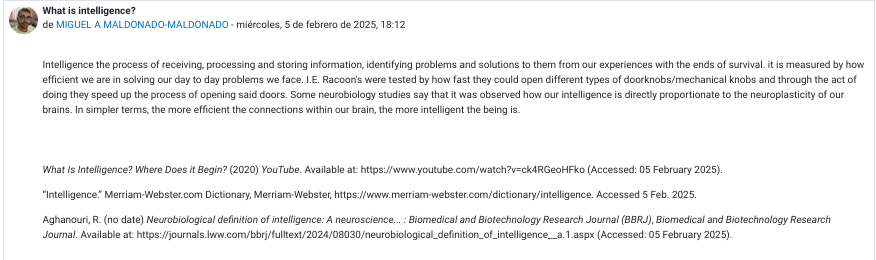
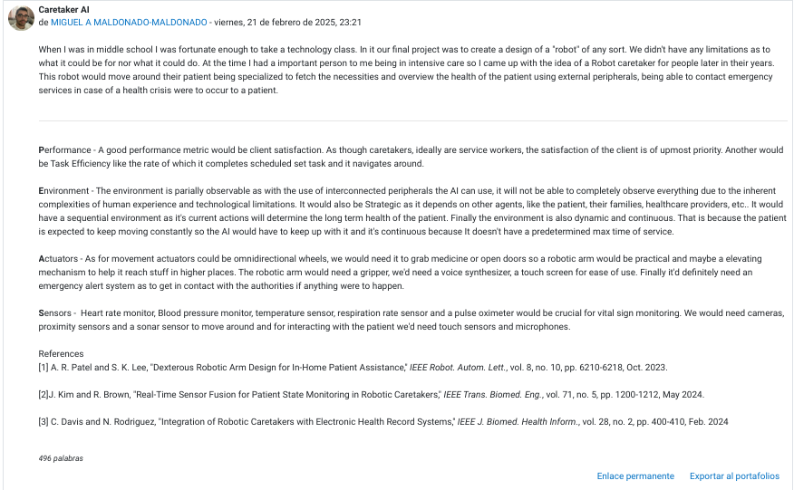
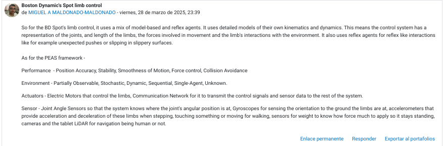

# AI-portfolio

## Course Overview

This portfolio is made as a demonstration of my progress, learnings and accomplishments of in my ICOM5015 Artificial Intelligence class. Artificial Intelligence is proof that with rationality and optimization we can implement many fields of study to create new solutions.

Due to this course I have learned to recognize when a problem is not amenable to a traditional programming solution, but might be amenable to informed or uninformed search with or without constraints, knowledge-based or learningbased methods.

I also learned to explain and apply AI algorithms in diverse problem types.

I can now analyze problems comparing different AI methods to decide the most appropriate
approach or approaches for their solution.

But most importantly I learned to design and implement an AI system throughout the various challenging programming assignments.

## Exams

As of the day I'm writing this I have a 62% on the only partial exams, I expect to be able to raise this grade on our final exam. 

## Programming Assignments 

### Programming Assignment I

In Chapter II called Agents we did a study to see if python is fast or slow 

Video(Spanish) - https://youtu.be/0hEylpkEBtk 

Report(English) - https://github.com/Miguel-Maldonado10/AI-portfolio/blob/main/IsPythonFastOrSlow.pdf

In summary we understand that base python using iterations to display a matrix is much slower than using libraries optimized for these tasks. With use of these libraries we can achieve faster Python programs.

### Programming Assignment II

We also had a programming assignment in this chapter for agents. These are our results on our programming assignment for agents 

Video(Spanish) - https://youtu.be/oJgBcUDebY8

Report(English) - https://github.com/Miguel-Maldonado10/AI-portfolio/blob/main/Chapter2PAReport.pdf

In this one we learned that giving more relevant information to an agent helps it traverse an environment as well as adding randomized elements and states can prevent our agent getting stuck or even help it escape in particular maze like situations. However we did make an incorrect statement in the report stating that a simple reflex agent would be able to sense it's immediate surrounding however that is incorrect, a simple reflex agent can only sense it's current location.

### Programming Assignment III

In Chapter III called Solving Problems by Search we covered the basic concepts of search. I learned that finding one solution in a decision tree does not really require an informed search algorithm as it does not need any additional information beyond the root and the first solution goal node. As well as that the problem formulation for search algorithm needs the path cost, goal test, Description of what each action does (Transition Model), Description of possible actions available to the agent in each state and initial state.

Afterwards we studied uninformed search algorithms such as breadth first, depth first and uniform cost search. And we learned whether or not these were optimal, complete, their time complexity and space complexity as well as how they work. 

Then we studied informed search where we covered complete and admissable heuristics, as well as greedy best first search and A*search. With those components we then did a programming assignment for this chapter.

We were tasked with solving the exercises 3.7 and 3.9 of the the Russell, S. and Norvig, P. Artificial Intelligence: A Modern Approach. 3rd Edition book. We had to create an agent to traverse a continuous area with polygonal obstacles and solve the Cannibals and Missionaries puzzle where we cross a river on a small boat with the same amount of cannibals as the amount of missionaries.

Video(Spanish) - https://youtu.be/oAyXamHATFY

Report (English) - https://github.com/Miguel-Maldonado10/AI-portfolio/blob/main/Chapter3PAReport.ipynb

### Programming Assignment IV

In Chapter IV name Beyond classical search, we covered the simulated annealing search, hill-climbing, local beam search, genetic algorithms local search in continuous spaces, Online and Offline search. It was a long chapter with pretty complex topics and in which we had another programming assignment.

In this programming assignment we had to generate a large number of 8-puzzle and 8-queens instances and solve them (where possible) by hill climbing (steepest-ascent and first-choice variants), hill climbing with random restart, and simulated annealing. Measure the search cost and percentage of solved problems and graph these against the optimal solution cost. 

Video(Spanish) - https://youtu.be/hv3zI87VeVU

Report(English) - https://github.com/Miguel-Maldonado10/AI-portfolio/blob/main/Chapter4PAReport.ipynb

### Programming Assignment V

In Chapter V called Adverserial Search, we studied game theory, optimal decisions, α-β pruning, imperfect, real-time decisions and stochastic games. We implemented these topics on our fifth programming assignment where we were asked to select one of the given adversarial searches and generate an agent which will base their decisions based on the search algorithm on a Dominoes game. We selected Monte Carlo simulation as it seemed more apporpriate for the assignment then deep neural networks but more accurate then our other options.

Video(Spanish) - https://youtu.be/LCwb4y-Xpj0

Report(English) - https://github.com/Miguel-Maldonado10/AI-portfolio/blob/main/Chapter5PAReport.ipynb

## Quizzes

My overall quiz score is a D, while I really understood topics like Critical Thinking, Inmformed and Uninformed Search and Adversarial Search I struggled on topics like Hill CLimbing and heuristic functions, Simmulated Annealing and Genetic Algorithm.

## Essays and Forums

Before working on AI we must first understand the concept of intelligence. In our first forum I expressed my initial understanding of intelligence, as in our What is Intelligence Forum 

Upon researching the subject we had to write in a forum our findings. This was my post - 

I learned how much of our biological build determines our Intelligence from neuroplasticity and how the efficiency of connections in our brain determines how well we can identify problems, solve problems, how much information we can store and how well we receive and process information. 

After further studies, on intelligence we were assigned on writing an essay on whether or not artificial intelligence qualifies as real intelligence to which I link my essay on the matter below in which i write about how I believe from my research that as long as artificial intelligence relies on human intelligence to exist it cannot be considered true intelligence.

https://github.com/Miguel-Maldonado10/AI-portfolio/blob/main/IsAIRealIntelligence.pdf

An agent is anything that can be viewed as receiving information from its environment through sensors and acting up on that environment through sensors and acting up on that environment through actuators. To evaluate these we learned the PEAS analysis system. P - Perfomance, E - Environment, A - Actuators and S - Sensors. We were assigned to do a practical implementation of AI using PEAS analysis on any idea realistic in the near future. I will include my forum post below.

This forum helped me a lot to learn the different types of environments as it was the one aspect of PEAS analysis I was really struggling with at the time. 

Later in the semester we did another PEAS analysis forum for the Boston Dynamics Spot. We were given the video https://youtu.be/s6_azdBnAlU?si=hj2E6n27prVgoq2J Then we were tasked to select one of Spot's Functions such as navigation, obstacle avoidance, route and contingency planning or Limb Control, we had to identify that function's agent type, then do the PEAS analysis and justify our claims. This was my forum post.

I enjoyed this exercise as it reinforced PEAS analsis to an already existing function which we were able to see through the video as well as practice identifying agent types.
 

## Teamwork and Collaboration

During this semester I've worked as a pair with my partner Alejandro Burgos. He was a great help in helping finish the projects on time as he really helped me in times I've gotten stuck and he's helped a lot with recording the demos for the course. 

We were able to supplement each other on our weak topics and through reviewing each other's work we were able to correct one another respectfully. I've come to value that mutual respect in group projects and accompanied by patience it's helped me improve my collaboration skills.

## Self-Assesment

I believe myself to have understood the course outcomes thanks to the professor's very explicit feedback. While as of today I may not have performed the best grade-wise It's been a very fruitful learning experience. 

Although I am proud to say I feel very confident in topics such as agents, uninformed searching algorithms and PEAS analysis, I believe I must continue to work on my studies in heuristic functions and genetic algorithms as they gave me the most issues. 

## Current AI Literature Review

At the beggining of the semester we covered many documents, In this section on the portafolio I'll be summarizing them and explaining why they are important to the course.

https://www.criticalthinking.org/pages/defining-critical-thinking/766#top

In Summary:
Critical thinking is defined as the intellectually disciplined process of actively and skillfully conceptualizing, applying, analyzing, synthesizing, and/or evaluating information gathered from observation, experience, reflection, reasoning, or communication. It is based on universal intellectual values like clarity, accuracy, precision, consistency, relevance, sound evidence, good reasons, depth, breadth, and fairness. The process involves examining basic elements of thought such as purpose, assumptions, points of view, and implications. Essentially, critical thinking is self-directed, self-disciplined, self-monitored, and self-corrective thinking aiming for high-quality reasoning. Developing it requires cultivating intellectual virtues like integrity, humility, empathy, and confidence in reason. 

This article helped me understand more of how I needed to think to solve most AI problems in the programming assignments. We do not just simply memorize but it requires the knowledge or experience and know what to apply where to solve these problems.

## Applications and Demonstrations

I will provide a list below of some of my code files, the report and the video presentations of these programming assignments.

Code for an agent to traverse a continuous space with polygonal obstacles
https://github.com/Miguel-Maldonado10/AI-portfolio/blob/main/search.py

Corresponding Report - https://github.com/Miguel-Maldonado10/AI-portfolio/blob/main/Chapter3PAReport.ipynb
Corresponding video demonstration - https://youtu.be/oAyXamHATFY

In this one I applied A*Search algorithms and Breadth first search algorithms to navigate a plane with polygonal obstacles.
